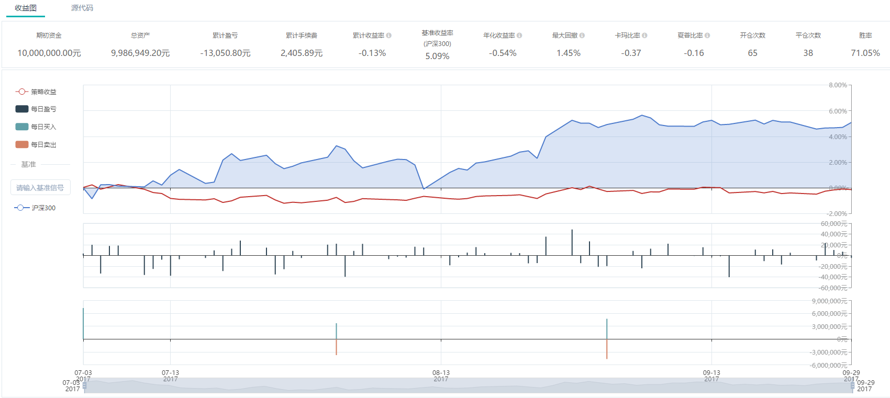

# alpha对冲(股票+期货)
量化交易经典策略：alpha对冲(股票+期货) ，利用股指期货进行对冲的股票策略

## 源码
```python
# coding=utf-8
from __future__ import print_function, absolute_import, unicode_literals
from gm.api import *
'''
本策略每隔1个月定时触发计算SHSE.000300成份股的过去的EV/EBITDA并选取EV/EBITDA大于0的股票
随后平掉排名EV/EBITDA不在最小的30的股票持仓并等权购买EV/EBITDA最小排名在前30的股票
并用相应的CFFEX.IF对应的真实合约等额对冲
回测数据为:SHSE.000300和他们的成份股和CFFEX.IF对应的真实合约
回测时间为:2017-07-01 08:00:00到2017-10-01 16:00:00
'''
def init(context):
    # 每月第一个交易日09:40:00的定时执行algo任务
    schedule(schedule_func=algo, date_rule='1m', time_rule='09:40:00')
    # 设置开仓在股票和期货的资金百分比(期货在后面自动进行杠杆相关的调整)
    context.percentage_stock = 0.4
    context.percentage_futures = 0.4
def algo(context):
    # 获取当前时刻
    now = context.now
    # 获取上一个交易日
    last_day = get_previous_trading_date(exchange='SHSE', date=now)
    # 获取沪深300成份股
    stock300 = get_history_constituents(index='SHSE.000300', start_date=last_day,
                                                end_date=last_day)[0]['constituents'].keys()
    # 获取上一个工作日的CFFEX.IF对应的合约
    index_futures = get_continuous_contracts(csymbol='CFFEX.IF', start_date=last_day, end_date=last_day)[-1]['symbol']
    # 获取当天有交易的股票
    not_suspended_info = get_history_instruments(symbols=stock300, start_date=now, end_date=now)
    not_suspended_symbols = [item['symbol'] for item in not_suspended_info if not item['is_suspended']]
    # 获取成份股EV/EBITDA大于0并为最小的30个
    fin = get_fundamentals(table='tq_sk_finindic', symbols=not_suspended_symbols,
                           start_date=now, end_date=now, fields='EVEBITDA',
                           filter='EVEBITDA>0', order_by='EVEBITDA', limit=30, df=True)
    fin.index = fin.symbol
    # 获取当前仓位
    positions = context.account().positions()
    # 平不在标的池或不为当前股指期货主力合约对应真实合约的标的
    for position in positions:
        symbol = position['symbol']
        sec_type = get_instrumentinfos(symbols=symbol)[0]['sec_type']
        # 若类型为期货且不在标的池则平仓
        if sec_type == SEC_TYPE_FUTURE and symbol != index_futures:
            order_target_percent(symbol=symbol, percent=0, order_type=OrderType_Market,
                                 position_side=PositionSide_Short)
            print('市价单平不在标的池的', symbol)
        elif symbol not in fin.index:
            order_target_percent(symbol=symbol, percent=0, order_type=OrderType_Market,
                                 position_side=PositionSide_Long)
            print('市价单平不在标的池的', symbol)
    # 获取股票的权重
    percent = context.percentage_stock / len(fin.index)
    # 买在标的池中的股票
    for symbol in fin.index:
        order_target_percent(symbol=symbol, percent=percent, order_type=OrderType_Market,
                             position_side=PositionSide_Long)
        print(symbol, '以市价单调多仓到仓位', percent)
    # 获取股指期货的保证金比率
    ratio = get_history_instruments(symbols=index_futures, start_date=last_day, end_date=last_day)[0]['margin_ratio']
    # 更新股指期货的权重
    percent = context.percentage_futures * ratio
    # 买入股指期货对冲
    order_target_percent(symbol=index_futures, percent=percent, order_type=OrderType_Market,
                         position_side=PositionSide_Short)
    print(index_futures, '以市价单调空仓到仓位', percent)
if __name__ == '__main__':
    '''
    strategy_id策略ID,由系统生成
    filename文件名,请与本文件名保持一致
    mode实时模式:MODE_LIVE回测模式:MODE_BACKTEST
    token绑定计算机的ID,可在系统设置-密钥管理中生成
    backtest_start_time回测开始时间
    backtest_end_time回测结束时间
    backtest_adjust股票复权方式不复权:ADJUST_NONE前复权:ADJUST_PREV后复权:ADJUST_POST
    backtest_initial_cash回测初始资金
    backtest_commission_ratio回测佣金比例
    backtest_slippage_ratio回测滑点比例
    '''
    run(strategy_id='strategy_id',
        filename='main.py',
        mode=MODE_BACKTEST,
        token='token_id',
        backtest_start_time='2017-07-01 08:00:00',
        backtest_end_time='2017-10-01 16:00:00',
        backtest_adjust=ADJUST_PREV,
        backtest_initial_cash=10000000,
        backtest_commission_ratio=0.0001,
        backtest_slippage_ratio=0.0001)
```

## 绩效
